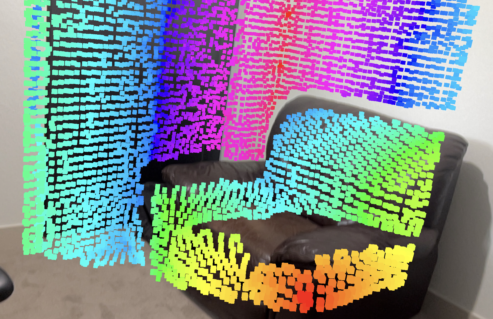
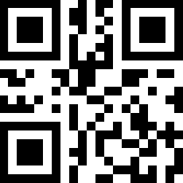

# AR-RViz : Augmented Reality Robot Visualization


This Unity project allows you to view ros topics overlayed  on a real robot in augmented reality.

This project started out as a hackathon project for Cobalt Robotics. Check out what they are doing at
[https://www.cobaltrobotics.com](https://www.cobaltrobotics.com)

This project heavily utilizes the work done by Unity's simulation team and the fork of the their
open source package I created [ROS-TCP-Connector](https://github.com/kodie-artner/ROS-TCP-Connector)

<p float="left">
  
  
</p>

## Compatibility

### Mobile Device

Tier 1:
- iPhone/iPad Pro Series
- Androids with depth sensors

Tier 2: Won't localize as well, need to scan the room more before starting.
- iPhones/iPads with ARKit support
- Androids with ARCore support

Tier 3:
- Hololens (Untested, ROS-TCP-Connector may not work, UI would need update)

### Robot

Any ROS1 or ROS2 robot that can run [ROS-TCP-Endpoint Package](https://github.com/Unity-Technologies/ROS-TCP-Endpoint)
is compatible with the app.

# Setting Up

## Assumptions

For the app to work correctly, your robot needs to be localized to a map frame with the tf available.
If you don't have localization, you can still use the app but the phone will need to be localized anytime
the robot is moved via the QR code scanner or manual localization.

Robot and mobile device need to be on the same network.

## Getting the app

The app can be downloaded for the iPhone/iPad via the app store [AR-RViz](https://apps.apple.com/us/app/arrviz/id6449395701?uo=2). For android,
you can download the apk from the [release page](https://github.com/kodie-artner/AR-RViz/releases/latest)

## Quick Start Guide

1. Launch ros_tcp_endpoint.
2. Open app and connect to ip of robot.
3. Select the base link of the robot.
4. Manually localize robot.
5. Select topics to view.

## ROS Setup

To setup ros to work with AR-RViz, you will need to install the
[ROS-TCP-Endpoint Package](https://github.com/Unity-Technologies/ROS-TCP-Endpoint).
For ROS1 use the `main` branch, for ROS2 use `main-ros2`.

Once the package is built, launch:
```
ROS1
roslaunch ros_tcp_endpoint endpoint.launch

ROS2
ros2 launch ros_tcp_endpoint endpoint.py
```

*The default port is 10,000.

Get the ip address of the computer running the ros_tcp_endpoint and the port selected above. you'll
need both to connect your robot from the phone.

### Downsampling Topics

The ROS-TCP-Connector can only handle a limited amount of bandwidth so it is likely you will need to downsample and or
throttle the point cloud topics if the point clouds start to lag. To easily downsample point clouds check out the
ROS1 [pcl_ros Voxel Filtering](http://wiki.ros.org/pcl_ros/Tutorials/VoxelGrid%20filtering)

In the following ROS1 launch file, I  throttle the point cloud to 5 hz and use a voxel grid with a 0.04 leaf size and
3m max distance along the z axis.

```
    <!-- Throttle to 5 hurts from the original 30hz -->
    <node name="astra_throttled" type="throttle" pkg="topic_tools" args="messages /camera/depth/points 5 /camera/depth/points/throttled"/>

    <node pkg="nodelet" type="nodelet" name="pcl_manager" args="manager" output="screen" />

    <!-- Run a VoxelGrid filter to clean NaNs and downsample the data -->
    <node pkg="nodelet" type="nodelet" name="voxel_grid" args="load pcl/VoxelGrid pcl_manager" output="screen">
        <remap from="~input" to="/camera/depth/points/throttled" />
        <rosparam>
            filter_field_name: z
            filter_limit_min: 0.01
            filter_limit_max: 3
            filter_limit_negative: False
            leaf_size: 0.04
        </rosparam>
    </node>
```

## App Setup

To connect to the robot, input the ip address and port and then click connect. If it doesn't connect,
checkout the Debugging section below.

### Setttings


**QR Code Link:** This is the link in the tf tree that should correlate to the where the QR code is placed on the robot
or in the world. At the moment only this QR code will work:

**QR Code Size:** The size of the physical QR code. You can select sizes from 5cm to 25cm in increments of 1cm.

<p float="left">
  
  
</p>

**Base Link:** This should be the base link of the robot. Often times this is just called base_link.
It is expected that the base link is not offset from the ground with the z frame pointing up.

**Pose Topic:** The topic to use with the pose tool. The pose tool will send a PoseStamped msg over this topic.
It can be used to send a navigation goal, initial pose, or anything other PoseStamped msg.

**Pose Frame ID:** The frame to be sent as the frame_id of the PoseStamped msg when using the Pose tool.

**Topics:** The topics section allows you to choose which topics are shown in the visualization. If a topic is greyed out
it means there isn't a visualizer for that topic type. Check the creating visualizations sections to add custom
visualizations.

### Usage

Scan the room with the phone to make sure the phone is well localized. The better it is scanned, the better
the phone will stay localized with the robot.

Once ros is connected, the settings inputted, and the topics selected, you can now localize the phone to
the robot. There are two ways to do this, with the QR code scanner or by manually selecting the base_link frame.

**QR Code:** Select the QR code mode on the bottom right, make sure the camera is in good view of the code,
and then press and hold the action button until the green overlay appears.


**Manual Localize:** Select the localize button, move the target to the base link on the robot and then press and hold
the action button. While holding, move the phone to set the direction of the base link.


**Pose Selector:** Same mechanism as Manual Localize. Select the Pose button, move the target to the goal location and then press and hold the
action button to select the direction. The pose topic and pose frame id both need to be set in order for this tool to be used.


**Manipulate:** The manipulate option allows you to control InteractiveMarkers. When in this mode, you will
see a crosshair in the center of the screen. Point it towards an interactive marker until it expands slightly.
Now press the action button and the interactive marker will follow the motion of of the phone.
This feature could be used to control a robotic arm if the end effector is set to follow the interactive marker.
Note: If you obscure the cameras, the localization may drift. Be sure to have safeties on the robot in case of drift.


## Visualizations

The visualizations of topics can be edited in the source code so that topics show are visualized in different ways.
To edit a visualization, check out the SensorVisualizers folder for examples. Once you create a new visualizer,
you'll need to add it to the DefaultVisualizationSuite in the main scene.

Many of the visualizations are untested so if you find one that doesn't look like it is working correctly or just
doesn't look good, feel free to open an issue.

## Building from Unity

To build the app from source, you will need to:
```
git clone git@github.com:kodie-artner/AR-RViz.git
cd AR-RViz
git submodule update --init --recursive
```
Download Unity version 2021.3.x. [Download Page](https://unity.com/download)
Download either the ios or android build package.
Open the project with Unity
Build the project via file/"Build Settings" Build
More info can be found on building Unity projects [here](https://docs.unity3d.com/Manual/PublishingBuilds.html)

## Future Features

- Change visualization settings, point size, color, etc.
- Support for custom QR Codes
- Importing urdf's from ros
- Save/Load configurations
- Visualize TF
- Better UI when losing connection and reconnecting to ros
- More Modes for manipulating interactive markers. Position only, rotation only, etc.
- Add occlusion button so objects aren't rendered if a person/object is in front.
- Apple Headset support
- Meta Quest 3 support

## Debugging

- If it doesn't connect or you don't see any topics appear, make sure there aren't any firewalls up.
Get the ip address of your device and check if you can ping it from the robot.
- If the visualizations are lagging, select fewer topics or downsample the point clouds. You may need to restart
the app after lagging has started to get it to function normally.
- If it is still lagging after downsampling, check if the /tf topic rate is really high. All the messages have to go
through the tcp port so if /tf is at say 13,000 hz which was the case for me when I was using the
static_transform_publisher, it will clog up the port.
- If the points are shifted slightly and you are using the QR code localizer,
check that the size of the QR Code is correct

## Contributing

Feel free to open a pr if you have a bug fix or enhancement. See the issue tracker for a list of known bugs
and possible enhancements.

### Linter

csharpier

`dotnet csharpier <script_location>`

## Similar Projects

IViz: https://github.com/KIT-ISAS/iviz
Very cool project porting over much of RViz's functionality to mobile

ARViz: https://github.com/hri-group/arviz
ROS and mixed reality for Hololens
